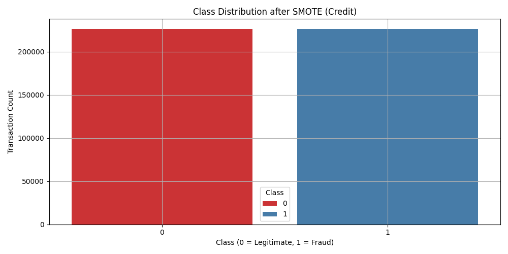
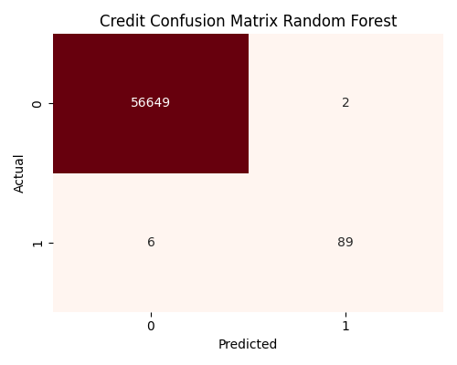
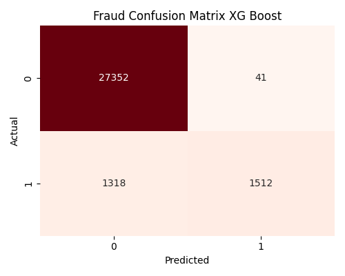
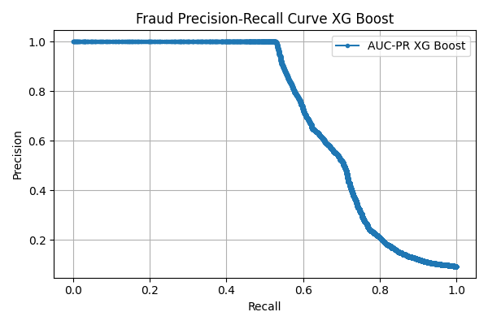

# Fraud Detection Cases for E-Commerce and Bank Transactions


[](https://github.com/nuhaminae/Fraud-Detection-Cases-for-E-Commerce-and-Bank-Transactions/actions/workflows/CI.yml)


## Overview
This project tackles the detection of fraudulent activities across e-commerce and banking transactions using machine learning and geolocation intelligence. It emphasises strong data preprocessing pipelines, class imbalance handling, and interpretable modelling to balance security and customer experience.

---
## Key Features
- Modular preprocessing scripts for fraud detection datasets.
- Feature engineering tailored to time-based patterns and transaction velocity.
- Class imbalance handling using SMOTE with strict datatype safeguards.
- Scaled, reproducible train/test splits for both bank and e-commerce transactions.
- CI pipelines and pre-commit checks for code consistency and quality.
- SHAP-based model explainability integrated for transparency. 

---
## Table of Contents
- [Project Background](#project-background)
- [Data Sources](#data-sources)
- [Project Structure](#project-structure)
- [Installation](#installation)
- [Usage](#usage)
- [Contribution](#contribution)
- [Project Highlights](#project-highlights)
- [Project Status](#project-status)

---
## Project Background
Fraud detection is a high-stakes domain where false positives disrupt user trust and false negatives cause financial losses. This project simulates real-world detection scenarios by preprocessing, modelling, and interpreting two datasets: e-commerce transactions and anonymised bank credit records.

It draws on business challenges faced by Adey Innovations Inc., where detection models must be explainable, accurate, and scalable for operational deployment

---
## Data Sources
1. _**CreditCard.csv**_
    * Bank transaction data with PCA-transformed features (V1–V28) and fraud labels.
    * Challenge: Extremely imbalanced and anonymised features.
2. _**FraudData.csv**_
    * Transaction metadata for e-commerce purchases.
    * Includes user and device identifiers, timestamps, purchase values, IP addresses, and fraud labels.
    * Challenge: High class imbalance + potential data leakage from IDs.
3. _**IpAddressToCountry.csv**_
    * Mapping IP ranges to country for geolocation enrichment.
    * Integrated via integer casting and merge logic.

---
## Project Structure
```
├── .dvc/                              # Data Version Control
├── .github/                           # CI workflows
├── data/
│   ├── raw/                           # Original datasets
│   └── processed/                     # Cleaned and transformed datasets
├── insights/                          # Plots and charts for reporting
├── models/  
├── notebooks/                         # Notebooks
│   ├── 01_eda.ipynb                   
│   ├── 02_feature_engineering.ipynb
│   ├── 03_modelling.ipynb              
│   └── 04_model_explainability.ipynb  
├── scripts/                           # Core scripts
│   ├── _01_data_preprocessing.py
│   ├── _02_feature_engineering.py
│   ├── _03_train_model.py              
│   └── _04_explain_model.py            
├── tests/                              
├── .dvcignore
├── .flake8
├── .gitignore                         # Ignore unnecessary files
├── .pre-commit-config.yaml            # Pre-commit configuration
├── format.ps1                         # Formatting
├── pyproject.toml
├── README.md                          # Project overview and setup instructions
└── requirements.txt                   # Pip install fallback
```

---
## Installation
### Prerequisites

- Python 3.8 or newer (Python 3.12 recommended)
- `pip` (Python package manager)
- [DVC](https://dvc.org/) (for data version control)
- [Git](https://git-scm.com/)

### Setup
```bash
# Clone repo
git clone https://github.com/nuhaminae/Fraud-Detection-Cases-for-E-Commerce-and-Bank-Transactions
cd https://github.com/nuhaminae/Fraud-Detection-Cases-for-E-Commerce-and-Bank-Transactions
____________________________________________
# Create and activate virtual environment
python -m venv .fraudvenv
.fraudvenv\Scripts\activate      # On Windows
source .fraudvenv/bin/activate   # On Unix/macOS
____________________________________________
# Install dependencies
pip install -r requirements.txt
____________________________________________
# Install and activate pre-commit hooks
pip install pre-commit
pre-commit install
____________________________________________
# (Optional) Pull DVC data
dvc pull
```

---
## Usage
Once the environment is set up, you can execute the pipeline and inspect model outputs as follows:

1. Preprocessing & Feature Engineering

Run the core preprocessing and feature engineering scripts in order:
```bash
python scripts/_01_data_preprocessing.py
python scripts/_02_feature_engineering.py
```
These scripts clean raw inputs, merge geolocation data, and generate velocity-based and time-derived features.

2. Model Training

Train and evaluate baseline and ensemble models:
```bash
python scripts/_03_train_model.py
```
This stage uses stratified splits, handles class imbalance via SMOTE, and evaluates models using AUC-PR, F1-score, and confusion matrices.

3. Model Explainability via SHAP

Interpret model predictions using SHAP:
```bash
python scripts/_04_explain_model.py
```
This script generates both global insights (summary plots) and local decision breakdowns (force plots). Resulting visualizations are stored under:
- `insights/explainer/force_rf.png`
- `insights/explainer/force_xgb.png`
- `insights/explainer/summary_rf.png`
- `insights/explainer/summary_xgb.png`

### Explore with Notebooks
Notebooks are provided for exploratory and iterative development:
- `notebooks/01_eda.ipynb` — visual patterns in data
- `notebooks/02_feature_engineering.ipynb` — build fraud indicators
- `notebooks/03_modelling.ipynb` — train and test models interactively
- `notebooks/04_model_explainability.ipynb` — interpret predictions using SHAP

Open these with Jupyter or VSCode to navigate the workflow interactively.

### Code Quality

This project uses pre-commit hooks to automatically format and lint `.py` and `.ipynb` files using:

|Tool	    | Purpose                                       |
|:---------:|-----------------------------------------------|
| Black	    |Enforces consistent code formatting            | 
| isort	    |Sorts and organises import statements          |
| Flake8	|Lints Python code for style issues             |
| nbQA	    |Runs Black, isort, and Flake8 inside notebooks |

``` bash
# Format and lint all scripts and notebooks
pre-commit run --all-files
```

---
## EDA Visual Insights
The following plots illustrate key moments in the pipeline, revealing patterns that informed preprocessing and modelling decisions:

* Class Imbalance Before Resampling

* Resampled Class Balance Using SMOTE

* Class Imbalance Before Resampling

* Resampled Class Balance Using SMOTE

* Most Active Countries Based on IP Mapping

* Top 10 Countries by Fraud Rate


These visuals bring clarity to fraud distribution, justify SMOTE-based resampling, and highlight the role of geolocation enrichment in fraud detection.

## Credit Dataset Observations
|Model              |F1-Score   |	AUC-PR	|False Positives    |False Negatives    |
|:-----------------:|:---------:|:---------:|:-----------------:|:-----------------:|
|Logistic Regression|0.277      |0.860	    |421                |12                 |
|Random Forest	    |0.957      |0.957	    |2                  |6                  |
|XGBoost            |0.923      |0.899	    |3                  |11                 |
- Logistic Regression is very limited on fraud recall (12 missed frauds, 421 false alarms). That hurts customer experience.
- **Random Forest** dominates almost perfect separation, minimal confusion, and the highest AUC-PR.
- XGBoost is strong too, but slightly behind RF here.



## Fraud Dataset Observations
|Model              |F1-Score   |	AUC-PR	|False Positives    |False Negatives    |
|:-----------------:|:---------:|:---------:|:-----------------:|:-----------------:|
|Logistic Regression|0.614      |0.653      |1,273              |1,011              |
|Random Forest	    |0.675      |0.700	    |280	            |1,246              |
|XGBoost            |0.700      |0.710	    |41	                |1,318              |
- All models face difficulty separating fraud from legitimate activity, this reflects the complexity of transaction behavior.
- Logistic Regression struggles most with precision, lots of false positives.
- Random Forest balances both reasonably but still misses over 1,200 frauds.
- **XGBoost** shines with the fewest false positives but trades off slightly higher false negatives.




## SHAP Explainability Insights
To understand what drives fraud prediction, SHAP plots reveal model decisions both globally and per transaction.
* Credit Dataset – Random Forest Model
SHAP Summary Plot 

SHAP Force Plot (example fraud case)


* Fraud Dataset – XGBoost Model
SHAP Summary Plot 

SHAP Force Plot (example fraud case)


These plots help identify which features most influence predictions. For example, device transation count, velocity, hour of day, and time since signup are frequent drivers in flagged transactions.

---
## Contribution
Contributions are welcome! Please fork the repository and submit a pull request. For major changes, open an issue first to discuss what you would like to change.
Make sure to follow best practices for version control, testing, and documentation.

---
## Project Highlights
- Robust class-aware preprocessing and type casting to preserve fraud signals.
- Transaction frequency and velocity features per user/device.
- Engineered temporal features like Hour_Of_Day, Day_Of_Week, Time_Since_Signup.
- Advanced class imbalance correction using SMOTE post-encoding and datatype filtering.
- Defensive coding practices like safe_relpath, clean feature selection, and testable pipelines.
- Visual insights powered by SHAP, enhancing model explainability and business trust.

---
## Project Status
Final submission merged. Checkout the commit history [here](https://github.com/nuhaminae/Fraud-Detection-Cases-for-E-Commerce-and-Bank-Transactions). 
